# Task Manager

* Table of Contents
{:toc}

--------------------------------------------------------------------------------------------------------------------

## **1. Introduction**
Hello there! If you are reading this, you must be curious about *Task Manager*.
*Task Manager* is a tool built help you manage and keep track of tasks. 
With Task Manager you can set deadlines, monitor progress, add tags, search for tasks and more!

--------------------------------------------------------------------------------------------------------------------

## **2. Getting Started**

### 2.1 Quick Start

1\. Go to [https://dry-depths-11934.herokuapp.com/](https://dry-depths-11934.herokuapp.com/). 
   You should land on a page like this.
   
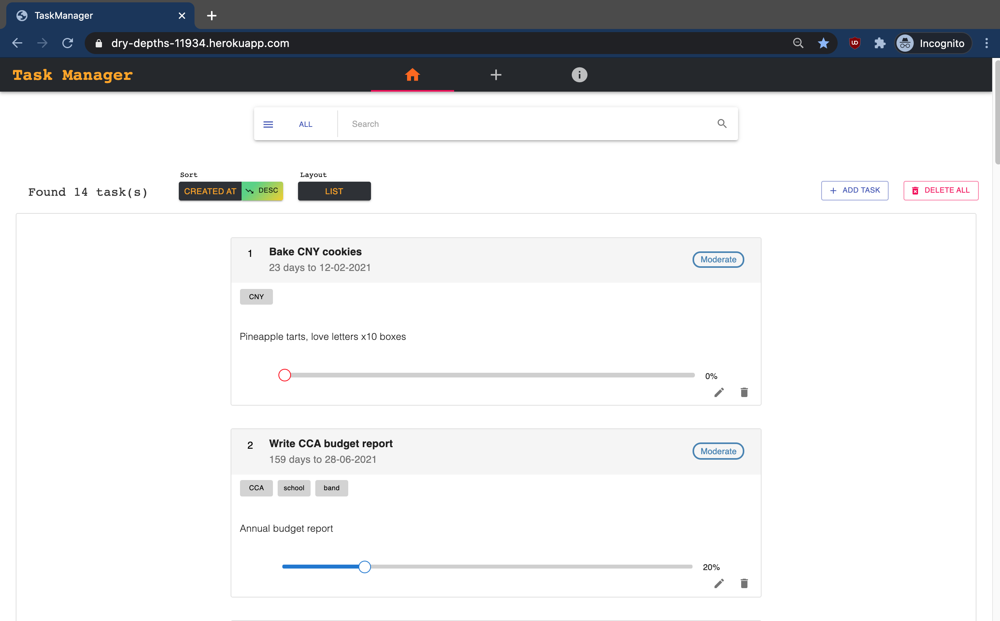

2\. The card-like boxes that you see are tasks (called task cards). These are sample data loaded for you to play with
   
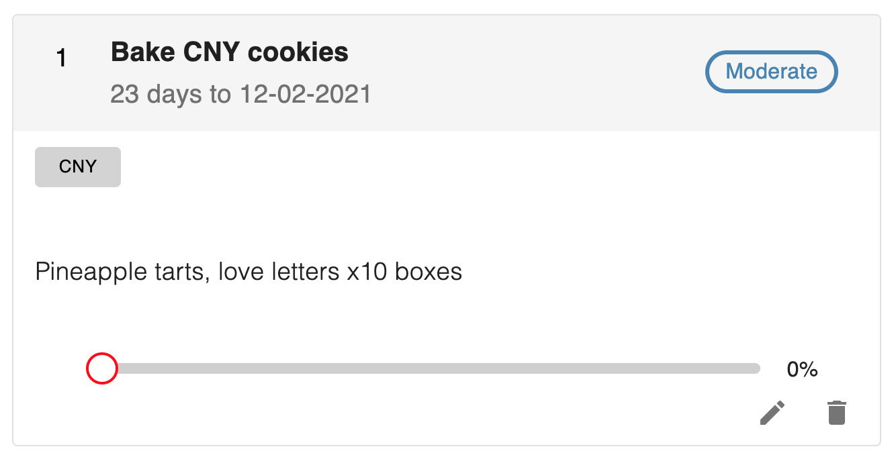

3\. To add your own task, click the 'Add Task' button on the Home page. Fill in the task details in the form and submit.

4\. To edit a task, click the 'Edit' icon on the task card and update the form.

5\. To delete a task, click the 'Delete' icon on the task card and click 'Ok' when prompted with a confirmation message.

6\. To delete all tasks, click the Delete All Button on the Home page and click 'Ok' when prompted with a confirmation message.

### 2.2 The Task Card

Task cards are used to display tasks and their information. 
Refer to the annotated example below to learn about the anatomy of a task card.

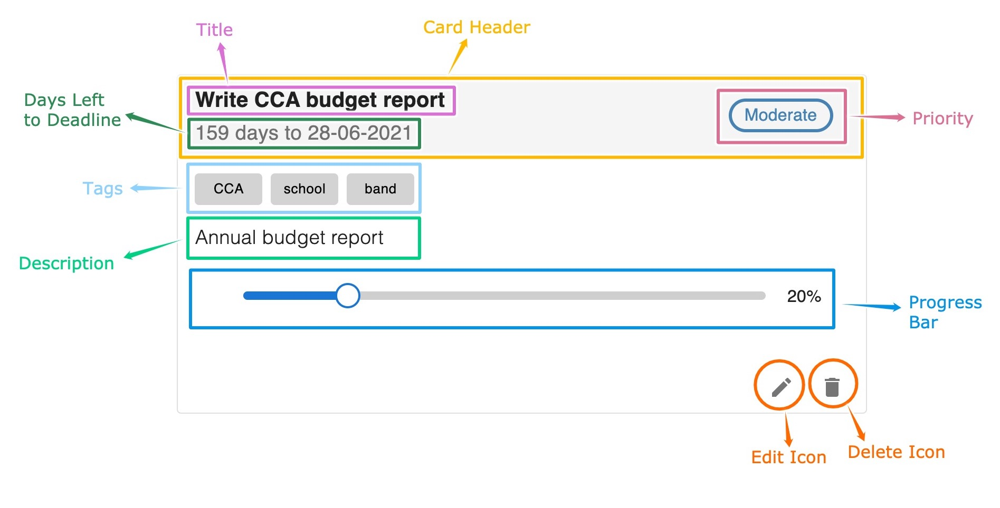

Read the next section to explore more features in greater detail!

--------------------------------------------------------------------------------------------------------------------

## **3. Features**

### 3.1 View All Tasks

Click the 'Home' tab on the site header to view your tasks on the Home page. 
This is also the landing page of the website. 

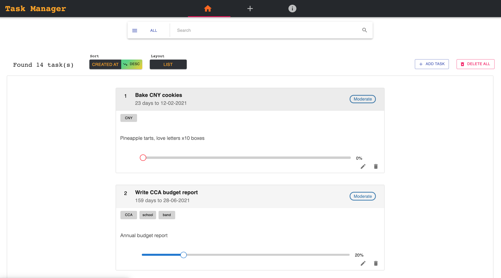

### 3.2 View a Task

Click the card header of a task card to view its individual page.

### 3.3 Add Task

Click the 'Add Task' tab (middle tab) on the site header or click the 'Add Task' button on the Home page.

A task can have the following information fields:

Field       | Requirement      | Description
------------|------------------|-----------------------
Title       | Compulsory       | Title/name of a task. Cannot be empty.
Description | Optional         | Description of a task.
Priority    | Optional         | Priority of a task. Can take values *Low*, *Moderate* or *High*.
Deadline    | Optional         | Deadline of a task. Takes the format DD/MM/YYYY.
Progress    | Default value 0  | Progress of a task in percentage. Can take values 0-100.
Tags        | Optional         | Tags eg. can be used to represent custom categories. Can have multiple tags but no repeats. 

 
:memo: When adding tags, press the 'Enter' or ',' key after typing it in the input box. 
This also means tags cannot have ',' characters in them.

:memo: Tags will appear as blue boxes below the input box if they have been successfully added.

:memo: To rearrange tags, use the mouse to drag and drop the blue tag boxes to the desired position.

**Example:**

:black_nib: 
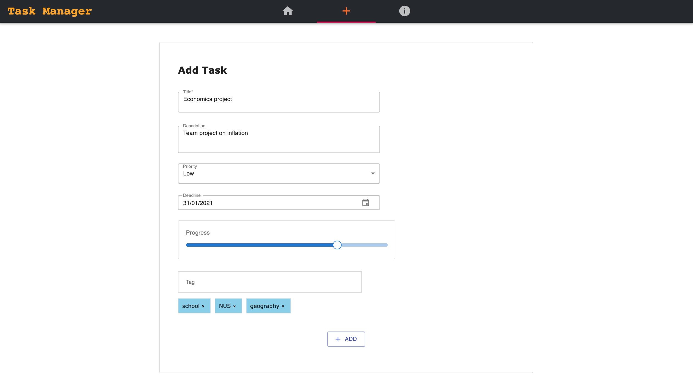

### 3.4 Edit Task

Click the 'Edit' icon at the bottom right of the task card.

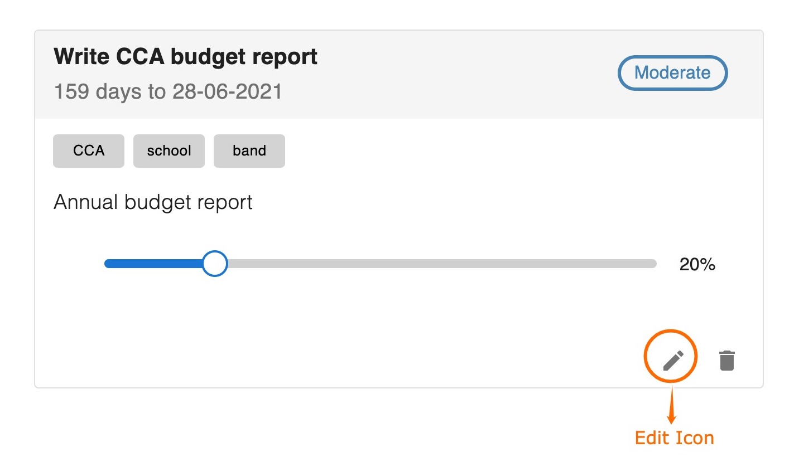

### 3.5 Delete Task

Click the 'Delete' icon at the bottom right of the task card.

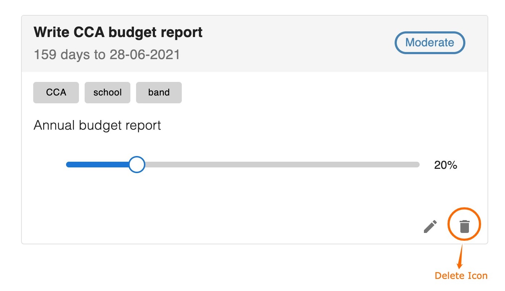

:exclamation: This action is not reversible. 
Please make sure you want to permanently delete the task before pressing the button.

### 3.6 Delete all Tasks

Click the 'Delete all' button on the Home page.

:exclamation: This action is not reversible.
Please make sure you want to permanently delete all tasks before pressing the button.

:memo: You may use this to delete the sample data if you have no need for them anymore.

### 3.7 Sort Tasks

Click the 'Sort' button in the Home page.
Toggle between four sorting fields in either descending or ascending order.

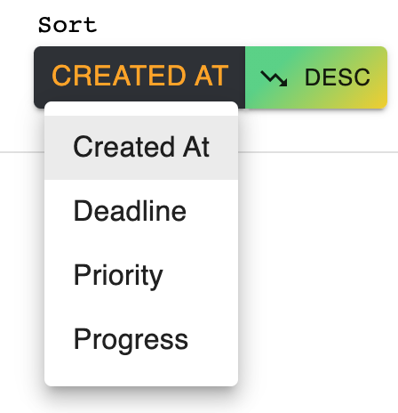

:memo: The default sorting is by 'Created At' in descending order. 

:memo: When sorting by Deadline or Priority (optional fields), only tasks that have these fields present will show. 
For example, when sorting by priority, tasks that have no priority will not show since there is no reasonable
sorting order for them.

**Examples:**

:black_nib: To display tasks that have highest priority first:

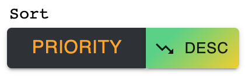

:black_nib: To display tasks that have the closest deadlines first:

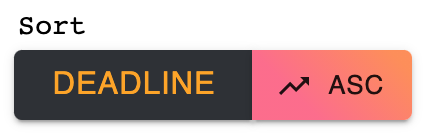

:black_nib: To display tasks that have the most progress first:

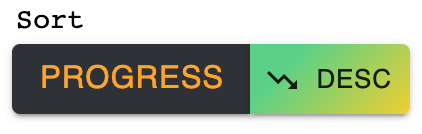

### 3.8 Search Tasks

Use the search box in the Home page. Type a string in the search box and press the 'Enter' key.
Toggle between six search fields.

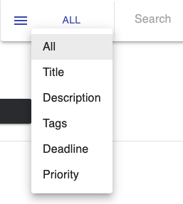

:memo: The search feature finds tasks which contain the specified search string, not just exact matches, and it is not case-sensitive.

:memo: The search feature can be used together with the sort feature to achieve more specific results.

:memo: When searching for Deadline , you can use '-', '/' or ' ' as date separators
eg. searching for'02-02-2021', '02/02/2021' and '02 02 2021' will all give the same results.

**Examples:**

:black_nib: To find tasks with Priority of *High*:

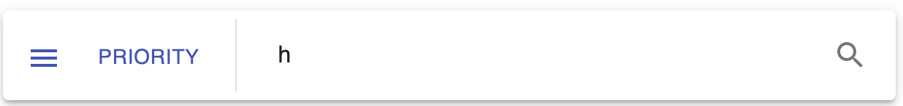

:black_nib: To find tasks with Deadline in the month of February:

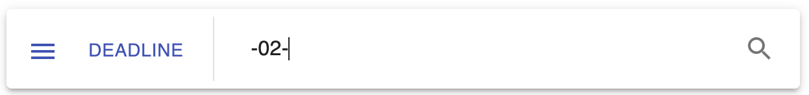

:black_nib: To find tasks with Tags containing 'school':

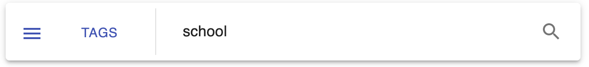

### 3.9 Change Page Layout

Click the 'Layout' button in the Home page.
Toggle between four layouts to display your tasks on the Home page.

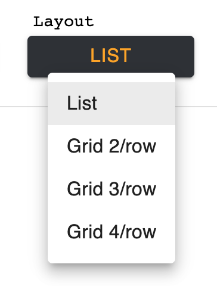

 

Layout       | Description
-------------|------------------------------------
List         | Default layout
Grid 2/Row   | 2 tasks per row
Grid 3/Row   | 3 tasks per row. Not recommended for smaller screens.
Grid 4/Row   | 4 tasks per row. Not recommended for smaller screens.

 
:memo: Suitability of layout configuration might differ depending on screen size. For example,
a 27-inch monitor will be able to display the Grid 4/Row layout comfortably while a 13-inch monitor 
might not be wide enough to display 4 tasks per row nicely. 

### 3.10 About Task Manager

Click the 'About Task Manager' tab (right tab) on the site header for a quick refresher of 
what you can do with *Task Manager*. It also contains a link to this user guide.

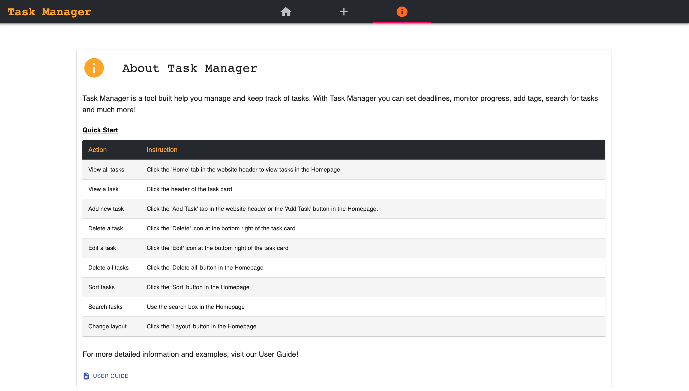

 
--------------------------------------------------------------------------------------------------------------------

 
 